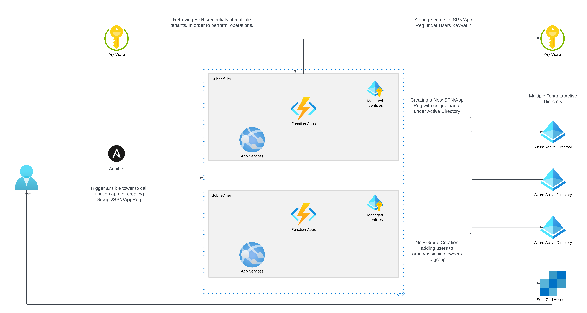

# Creating SPNs and Groups in Azure using APIs. 

This application explains how to programmatically create service princial names (SPNs), App Registrations, users and groups. 

## Prerequisites 

* An Azure Subscription. 
* Azure tenant 
* Permissions to Function App Service Principal, as **Application.ReadWrite.OwnedBy**

## How it Works

1. Azure Active direcotry users need to trigger the Ansible playbook by providing the required values in JSON or YAML format.
2. All Function apps using managed identities, So there is no requirement of rotating keys. 
3. Secrets for newly generated SPN/AppReg are stored under the keyvault provided by user.
4. Users need to grant the **Set** permission on the Function App's service principal to provide access. 
5. Properties and information of the SPNs/App Registration and groups are shared through email with the owners. 

## Topoloy 

  

## Usage 

* These scripts were developed to allow users to deploy service principals (SPNs) and application registration using an Ansible template. This reduces the need for teams to directly access Active Directory just to utilize the Ansible temaplate. 
* Role based access control is enforced since SPNs and application registrations are critical Active Directory resources. It is best if not all teams have access to Active Directory. 
* This is a self-service application which enables teams to access Active Directory with least privilege principals, granting access only to specific resources groups and resources as needed. 

## Topoloy For Multiple Tenants

  

## How it Works 

1. In this implementation, a single function app manages the service principal names(SPNs) of multiple tenants. This is achieved by utilizing the SPN credentials to manage SPNs and app registraitons across multiple tenants. 

2. By allowing groups to be created on multiple tenants, this implementation provides a flexible solution for managing and organizing resources across different tenants. 

3. The naming conventions of SPNs, app registrations and groups can be categorized based on tenant's naming conventions. This ensures consistency and easy identification of resources across different tenants. 

## Usage 

*  A single function app servers as the central location for managing SPNs and App Registrations across multiple tenants. To ensure a smooth operation, users must specify the tenant name as per the centralized documentation provided. 

* With reference to the tenant name, the tenant ID will be called, and the function app will able to create, update or delete SPNs within the tenant's Active Directory. 

* By adhering to these guidelines, users can effectively manage SPNs and app registration for multiple tenants while maintaining a consistent naming conventions across tenants. 

